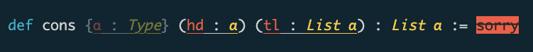

# `ansiColor`

A lean 4 library for ANSI escape sequences, very loosely based on [the `anes` rust crate][anes].

- [Documentation in the main source file][libTop], see in particular unsupported nesting patterns.
- [Examples.][examples]
- [Tests (more examples).][tests]

## 

```lean
import AnsiColor

def kw (s : String) : String := Ansi.cyan s
def var (s : String) : String := Ansi.red s
def typ (s : String) : String := Ansi.yellow <| Ansi.italic s

def binding (name : String) (type : String) (implicit : Bool := false) : String :=
  let s := Ansi.underline s!"{var name} : {typ type}"
  if implicit then Ansi.dim ("{" ++ s ++ "}") else s!"({s})"

def bad (s : String) : String :=
  Ansi.paint s (color := Ansi.black) (background := Ansi.red) (style := Ansi.strike)

def main : IO Unit := do
  println! s!"{kw "def"} cons \
    {binding (implicit := true) "α" "Type"} \
    {binding "hd" "α"} {binding "tl" "List α"} \
    : {typ "List α"} := \
    {bad "sorry"}\
  "

```




[anes]: https://crates.io/crates/anes (anes on crates.io)
[libTop]: ./AnsiColor.lean (main source file)
[examples]: ./Example.lean
[tests]: ./Tests
